# Technical & Computational Complexity Analysis

## 1. Algorithmic Complexity (Theoretical Big-O Bounds)

The Kahaani-Check audio processing and clinical trajectory pipeline operates through five sequential stages. The table below delineates the theoretical algorithmic time and working space bounds for each stage.

Let:
- $N$ = Number of raw audio samples in the recording (e.g., $16,000 \text{ samples/sec} \times 60\text{s} = 960,000$ floating-point samples).
- $T$ = Number of feature frames after 80-channel log-Mel filterbank extraction ($T \approx N / \text{hop\_length}$).
- $M$ = Number of generated transcript tokens/words.
- $S$ = Number of discrete timestamped speech segments detected ($S \ll M$).
- $K$ = Total historical observations recorded for an individual elder across all past check-ins.

| Pipeline Stage | Algorithm / Component | Time Complexity | Working Space Complexity | Computational Cost Classification |
| :--- | :--- | :--- | :--- | :--- |
| **1. Audio Quality Gate** | Short-Time Energy (RMS), SNR percentile estimation, clipping analysis | $O(N)$ | $O(N)$ in-memory load<br>*(approaches $O(1)$ with streaming chunks)* | **Secondary cost** (linear sweep across samples) |
| **2. Whisper STT Inference** | Transformer Encoder-Decoder (`faster-whisper` quantized CTranslate2 engine) | Model-dependent Transformer complexity *(self-attention scales quadratically with frame length $O(T^2)$)* | $O(\text{Model Parameters} + T \cdot D)$ | **Primary computational bottleneck** |
| **3. Speech Sufficiency Gate** | Interval sorting, overlapping speech region merging, duration validation | $O(S \log S)$ | $O(S)$ | **Negligible** ($< 5\text{ ms}$) |
| **4. Feature Extraction** | Articulation rate (WPM), pause density integration, lexical diversity (TTR) | $O(M)$ | $O(M)$ unique vocabulary hash set | **Negligible** ($< 10\text{ ms}$) |
| **5. Trajectory Engine** | Standard score ($Z$-Score) evaluation & sliding window trend analysis | $O(1)$ *(fixed 3-observation window)*<br>*$O(K)$ if recomputing full history* | $O(1)$ *(fixed window)* | **Negligible** ($< 5\text{ ms}$) |

### Whisper STT Complexity Clarification
Whisper STT has model-dependent Transformer inference complexity. Self-attention has approximately quadratic complexity with respect to sequence length, while practical inference latency depends on model size, audio duration, decoding strategy, and hardware. Because Whisper operates on fixed 30-second Mel spectrogram chunks using an encoder-decoder architecture with autoregressive token generation, a single universal Big-$O$ expression does not capture the full pipeline behavior. In practice, encoder compute depends primarily on audio frame length, while decoder compute scales with the number of generated tokens ($M$) and decoding strategy (greedy search vs. beam search).

### Audio Quality Gate Working Memory
In the current implementation, the Quality Gate loads the uncompressed waveform into memory via `librosa`/`soundfile`, yielding $O(N)$ working space. For large files, streaming or chunked window processing can reduce working memory substantially and approach $O(1)$ working buffer space without altering the $O(N)$ linear time complexity.

---

## 2. Pipeline Bottleneck Analysis

Computational expense across the Kahaani-Check pipeline is heavily stratified:

1. **Primary Bottleneck — Whisper STT Inference**:
   Whisper STT is the primary contributor to total processing latency and virtually all compute-bound CPU utilization.
2. **Secondary Costs — Audio Decoding, Resampling, & Network/DB Operations**:
   Decoding compressed audio formats (`.webm`, `.mp3`, `.m4a`) to 16 kHz mono PCM floating-point arrays and reading/writing records to PostgreSQL/Supabase require measurable I/O and CPU cycles, but execute an order of magnitude faster than transcription.
3. **Negligible Costs — Acoustic Biomarkers & Longitudinal Mathematics**:
   Tokenizing transcripts, computing word frequencies for Type-Token Ratio (TTR), merging pause intervals, and mapping statistical $Z$-scores execute in under 20 milliseconds combined.

---

## 3. Empirical Latency Breakdown (Live Measured Results)

> [!NOTE]
> Performance figures reflect the specific tested configuration and should be interpreted as representative empirical measurements rather than universal guarantees. Latency varies depending on CPU architecture, model size, audio duration, thread count, and system load.

The pipeline was benchmarked using an actual 124.6-second elder conversation recording (`de019eb5-4a65-4916-a30a-bfaa00a96b72.mp3`) using `faster-whisper` (`tiny` model, `int8` quantization, `cpu_threads=4`, greedy decoding):

```mermaid
gantt
    title Measured Timeline for 124.6s Audio Sample (8.91s total processing)
    dateFormat X
    axisFormat %s s
    section Quality Gate
    Audio Decode & SNR Estimation (5.61s, Measured) :0, 5611
    section Speech STT
    Whisper Greedy Decoding (3.30s, Measured) :5611, 8911
    section Biomarkers
    Acoustic Feature Extraction (< 0.01s, Measured) :8911, 8913
    section Clinical Trajectory
    Z-Score & Baseline Comparison (< 0.01s, Measured) :8913, 8915
```



### Direct Benchmark Measurements (124.6-Second Audio File)
- **Audio Duration**: **124.6 seconds** (Measured)
- **Audio Quality Validation**: **5.61 seconds** (Measured; full-waveform decoding and short-time RMS SNR calculation across 124.6s)
- **Whisper Speech-to-Text**: **3.30 seconds** (Measured; transcribed 299 words across 62 segments)
- **Acoustic Biomarker Extraction**: **< 0.01 seconds** (Measured)
- **Clinical Trajectory & Z-Score**: **< 0.01 seconds** (Measured)
- **Total Pipeline Computation**: **8.91 seconds** (Measured)
- **Real-Time Speedup**: **~14× faster than real-time playback** (Calculated from measured values: $124.6\text{s} / 8.91\text{s} \approx 13.98\times$)

### Clarification on 60-Second Check-in Estimates
The 1.59-second Whisper latency value sometimes cited comes from a direct linear normalization (`3.30 × 60 / 124.6`). However, Whisper does not necessarily scale linearly with audio duration because it operates on fixed 30-second Mel filterbank windows with autoregressive token decoding. Therefore:
- **1.59s Whisper inference**: Theoretical linear normalization, not a direct benchmark.
- **4.29s total latency for 60s**: Representative estimate based on component timings, not an independently measured benchmark.

Typical 60-second check-in processing is estimated at approximately **~3.5 to 5.0 seconds** under similar hardware conditions, but should not be reported as a measured result unless an actual 60-second recording is directly benchmarked.

---

## 4. Hardware Resource Footprint

| System Resource | Level / Budget | Evidence Type | Technical Rationale & Measurement Details |
| :--- | :--- | :--- | :--- |
| **Quantized Model Weights** | **72.04 MB** | **Measured** | The primary `model.bin` file in the local Hugging Face cache for `faster-whisper-tiny` (INT8 quantized CTranslate2 weights). |
| **Complete Model Cache** | **146.6 MB** | **Measured** | Total directory size of the complete cached model bundle on disk, including tokenizer, vocabulary, and configuration files. |
| **Audio File Storage** | **1.92 MB (1,962 KB)** | **Measured** | The tested 124.6-second MP3 recording occupied approximately 1.92 MB, corresponding to approximately 0.93 MB/minute for this sample. Total storage per check-in depends on codec, bitrate, duration, and format. |
| **RAM Footprint** | **~250 MB – 450 MB** | **Estimated / Representative** | Disk size does not directly equal runtime RAM. Runtime Resident Set Size (RSS) was not continuously instrumented with a dedicated memory profiler; it includes Python runtime and libraries (~80 MB), CTranslate2 model runtime allocations (~75 MB), tokenizer/configuration, temporary uncompressed audio buffers (NumPy/librosa), and application state. |
| **CPU Utilization** | **~60% – 85% observed peak** | **Observed / Expected Behavior** | CPU utilization was not directly instrumented with a hardware performance profiler; multi-threaded CTranslate2 matrix multiplication (`cpu_threads=4`) utilizes available CPU cores during active inference and drops to < 1% idle upon completion. |
| **GPU Dependency** | **None (CPU-Only)** | **Architectural Specification** | Designed and verified to execute fully on standard CPU environments without requiring dedicated GPU hardware. |

### Model Footprint vs. Runtime Memory
It is critical to distinguish on-disk model footprint from runtime working RAM:
- The quantized weights (`model.bin`) occupy **72.04 MB** on disk, and the complete model cache folder occupies **146.6 MB** on disk (both directly measured).
- Disk size must not be equated directly with runtime RAM. Runtime Resident Set Size (RSS) encompasses model runtime allocations, tokenizer/configuration, Python libraries (PyTorch/CTranslate2, NumPy, librosa, FastAPI), active model weights mapped into memory, temporary floating-point waveform arrays, and web application buffers.
- Because peak RSS was not continuously instrumented with a dedicated memory profiler during the test run, the 250–450 MB working footprint is an **engineering estimate / representative figure**, not a directly measured benchmark.

### Storage Footprint
The tested 124.6-second MP3 recording occupied approximately 1.92 MB, corresponding to approximately 0.93 MB/minute for this sample. Storage requirements should not be generalized to a universal "~1 MB per check-in" rule, as actual storage per session depends heavily on the audio codec (MP3, WebM Opus, WAV, M4A), encoding bitrate, sampling rate, and recording duration.

---

## 5. Mathematical Complexity of Clinical Trajectory Tracking

The longitudinal trajectory engine avoids iterative re-training or complex multi-layer machine learning during inference. It uses **parametric statistical mapping**:

### 1. Calibration Phase ($n \ge 3$ initial check-ins)
Establishes the elder's frozen reference baseline by computing the sample mean ($\mu$) and unbiased sample standard deviation ($\sigma$) for each biomarker:

$$\mu = \frac{1}{n} \sum_{i=1}^{n} x_i$$

$$\sigma = \sqrt{\frac{1}{n-1} \sum_{i=1}^{n} (x_i - \mu)^2}$$

- **Technical Meaning**: $\mu$ captures the elder's personal typical performance (e.g., habitual speech tempo or hesitation frequency); $\sigma$ measures expected day-to-day variability.

### 2. Longitudinal Scoring Phase (Post-Baseline)
For each new conversation observation $x_t$, the standardized $Z$-score is computed:

$$Z_t = \frac{x_t - \mu_{\text{baseline}}}{\sigma_{\text{baseline}}}$$

- **Technical Meaning**: Normalizes deviations into standard units. A value of $|Z_t| \ge 1.0$ indicates a 1-standard-deviation departure from personal baseline; a value of $|Z_t| \ge 2.0$ represents a deviation of at least two standard deviations from the personal baseline.

### 3. Online Trend Evaluation Complexity
Because the reference baseline $(\mu, \sigma)$ is stored as frozen scalar values in the database, calculating $Z_t$ requires **$O(1)$ constant-time arithmetic**. 

Furthermore, the stability filter checks a fixed-size sliding window of the **last 3 post-baseline observations** to prevent isolated outlier calls (such as temporary fatigue or illness) from triggering false alarms:
- **Fixed Sliding Window**: Requires **$O(1)$** operations and $O(1)$ space.
- **Full History Recomputation**: If an alternative implementation recalculates variance or trends over all historical check-ins on every request, complexity scales linearly with **$O(K)$**, where $K$ is the number of historical records.

---

## 6. Scalability Analysis

Consider a deployment serving:
- $E$ = Number of enrolled elders
- $C$ = Average check-in sessions per elder over a period
- $N$ = Number of audio samples per check-in recording

The aggregate computational workload scales according to:
- **Audio Processing & STT Workload**:
  $$\mathcal{W}_{\text{audio}} \approx O(E \times C \times N)$$
- **Trajectory & Biomarker Evaluation Workload**:
  $$\mathcal{W}_{\text{trajectory}} \approx O(E \times C)$$

Because $\mathcal{W}_{\text{audio}}$ dominates $\mathcal{W}_{\text{trajectory}}$ by several orders of magnitude, **Whisper STT inference is the primary determinant of system CPU and throughput requirements**. Scaling Kahaani-Check horizontally therefore primarily requires scaling audio inference workers.

---

## 7. Concurrency and Deployment Considerations

FastAPI manages I/O-bound requests asynchronously via its event loop (handling database lookups, client uploads, and authenticated sessions). However, speech-to-text inference and acoustic filtering are **CPU-intensive and compute-bound**. 

To prevent synchronous inference from blocking the asyncio event loop and degrading API responsiveness, the production architecture separates asynchronous endpoints from inference workers:

```
Client (Web / Mobile)
       │
       ▼
FastAPI Gateway (Async I/O)
       │
       ▼
Audio Validation (Quality Gate)
       │
       ▼
STT Worker (Process / Thread Pool / Task Worker)
       │
       ▼
Feature Extraction (Acoustic Biomarkers)
       │
       ▼
Trajectory Engine (Baseline Comparison)
       │
       ▼
PostgreSQL / Supabase Storage
```

*Note: While local development executes inference directly within managed worker threads, distributed production deployments can optionally decouple the STT Worker using Celery or Redis-backed task queues without modifying the core pipeline contract.*

---

## 8. Benchmark Methodology

- **Timing Instrumentation**: High-resolution Python timing instrumentation (`time.time()`) was used to isolate each functional block.
- **Direct Service Invocation**: The benchmark executed the actual production Kahaani-Check service functions: `check_audio_quality` (`quality_gate.py`), `transcribe` (`stt_service.py`), `extract_features` (`feature_extraction.py`), and `compare_with_baseline` (`trajectory_engine.py`).
- **Real Audio Payload**: The benchmark used a real stored audio recording from the application database (`de019eb5-4a65-4916-a30a-bfaa00a96b72.mp3`, 124.6s duration, 1.92 MB).
- **Test Machine & Configuration**: The benchmark was executed on the local development workstation (x86_64 CPU, 4 threads configured). Hardware specifications, thread count, background system activity, and I/O speed affect the results.
- **Interpretation**: Results should be interpreted as representative empirical measurements under the tested configuration rather than universal performance guarantees.

---

## 9. Assumptions and Limitations

1. **Hardware Sensitivity**: Practical latency depends heavily on CPU microarchitecture, available AVX/SIMD vector instruction sets, and background process contention.
2. **Model Trade-Offs**: Whisper STT latency scales with model size (`tiny`, `base`, `small`, `medium`) and decoding hyper-parameters (greedy decoding vs. multi-beam search).
3. **Network and I/O Variance**: Total end-to-end user latency includes network transfer time for audio payloads and external PostgreSQL/Supabase latency.
4. **Memory Allocation**: Estimated RAM figures reflect single-worker memory usage; concurrent parallel workers scale total memory proportionally.
5. **Memory Profile Assumption**: The reported $O(N)$ working space for the Quality Gate assumes complete in-memory array loading via `librosa`.
6. **Trajectory Storage Scaling**: Fixed-window trajectory analysis is $O(1)$, but full historical re-indexing or database queries across an elder's complete multi-year archive scale as $O(K)$.
7. **Non-Diagnostic Scope**: The trajectory engine detects statistical deviations in acoustic biomarkers to support families and inform healthcare providers; it is explicitly non-diagnostic and should not be presented as an independent clinical diagnosis.

---

## 10. Why This Architecture Is Efficient

- **CPU-Only Operation**: Optimized inference via `faster-whisper` and CTranslate2 removes any strict dependency on expensive GPU instances for current production tiers.
- **Quantized Neural Precision**: `int8` quantization reduces resident model weight file size to 72.04 MB while sustaining acceptable transcription fidelity.
- **Lightweight Feature Calculation**: Acoustic biomarker extraction, interval consolidation, and lexical diversity formulas evaluate in tens of milliseconds.
- **Constant-Time Longitudinal Tracking**: Frozen baseline metrics ensure elder trajectory evaluation runs in $O(1)$ time rather than requiring costly model retraining.
- **Clear Separation of Bottlenecks**: By identifying Whisper STT as the primary computational bottleneck, infrastructure capacity can be scaled horizontally by adding isolated inference workers without re-architecting the web and database layers.

---

## 11. Empirical Verification Summary

| Metric | Result | Evidence Type |
| :--- | ---: | :--- |
| Quantized model weight file | 72.04 MB | Measured |
| Complete model cache | 146.6 MB | Measured |
| Test audio duration | 124.6 s | Measured |
| Test audio size | 1.92 MB | Measured |
| Whisper STT | 3.30 s | Measured |
| End-to-end processing | 8.91 s | Measured |
| Real-time speedup | ~14× | Calculated from measured values |
| 60-second latency | Do not claim as measured unless directly benchmarked | — |
